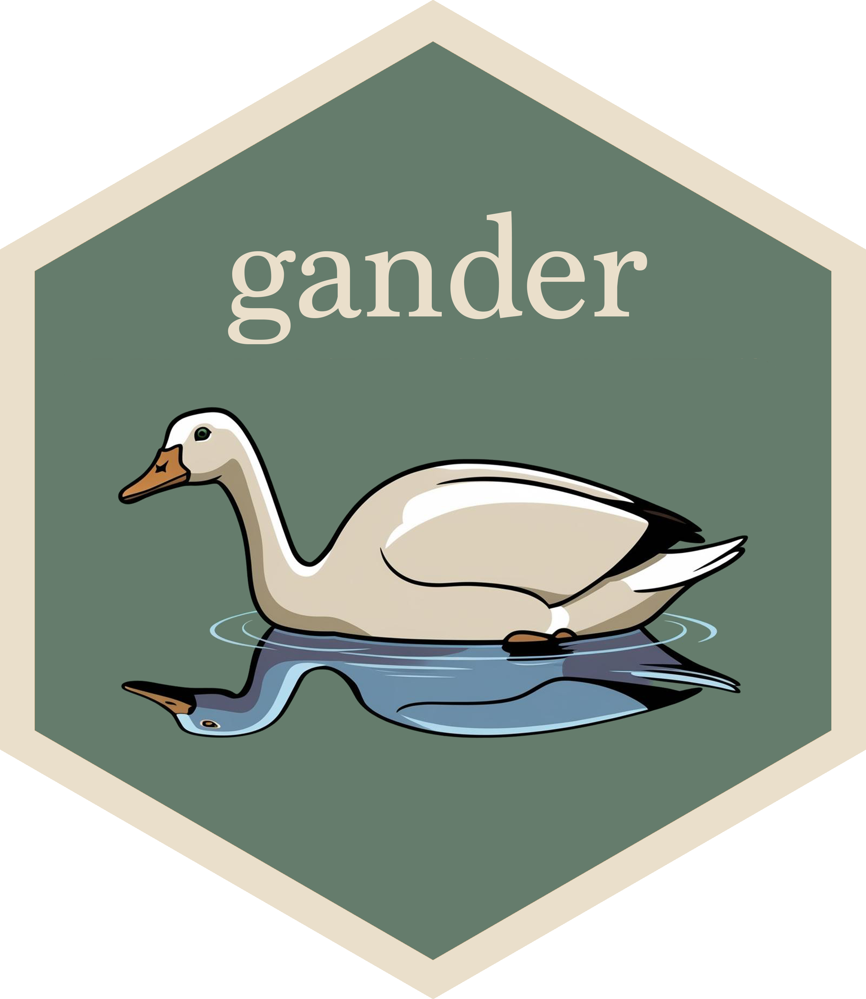

# AI Demos, May 2025

Source code and slides for my slot in the Posit AI demos session.

## A Simon-centric overview of R + LLMs

I wanted to leave some notes here to give a 30,000-foot perspective on some of the projects at the intersection of R + LLMs I'm spending time with. [ellmer](https://ellmer.tidyverse.org/) is at the core of all of them.

### In "production"

First, projects that are on CRAN and/or have entries on the Posit Blog:

| Package | Gist | Status | Learn More | In Python |
|---------|------|---------|------------|-----------|
|  | Automate repetitive R coding tasks | On CRAN since early 2025 | ["Introducing chores"](https://posit.co/blog/introducing-chores/) on the Posit Blog | ["Slash Commands"](https://docs.continue.dev/customize/deep-dives/slash-commands) from the Continue plugin are mostly the same thing |
|  | Inline edits / autocomplete *that knows about R objects* | On CRAN since early 2025 | ["Introducing gander"](https://posit.co/blog/introducing-gander/) on the Posit Blog | Can't name any, but I can only assume there are a good few. |

---

## Almost there

| Package | Gist | Status | h.t. | Learn More | In Python |
|---------|------|---------|------|------------|-----------|
|  | LLM evaluation / benchmarking in R  Especially relevant for customer adoption of ellmer. | Not yet on CRAN (a couple weeks?), been sharing publicly for a while.  Slotted for a talk on this package at conf. | JJ Allaire, who wrote the Python library that inspired the package  Sara Altman, for an upcoming Posit Blog post citing the package | A [series of blog posts](https://www.simonpcouch.com/blog/) where I evaluate models on R coding performance | vitals is a port of the widely adopted [Inspect](https://inspect.aisi.org.uk/) framework |
|  | Describing R stuff to LLMs  Not very glamorous, but a huge QOL improvement for R users using LLMs a lot. | Not yet on CRAN, just started sharing publicly. | This package is mostly **written by Garrick Aden-Buie** | Posit Blog post ["Teaching chat apps about R packages"](https://posit.co/blog/custom-chat-app/) | Leans pretty heavily on R's somewhat unique documentation system.  [llm-docs.com](https://llm-docs.com/about) has a model-in-the-middle approach to the same problem. |
|  | [Model Context Protocol](https://modelcontextprotocol.io/introduction) for R  Integrates R with many popular tools: Claude Desktop, Claude Code, Copilot in VS Code  FYI: MCP is quite hot right now. | Not yet on CRAN but just started sharing publicly.  Still a good bit of work to do before it's CRAN-ready. | Charlie Gao and Winston Chang | [Package website](https://posit-dev.github.io/acquaint/) | Natively supported with an official SDK. |

## In the future

I'd like to spend more time with these things once the above packages are CRAN-ready:

-   What if databot was for predictive modeling?

    -   Two challenges here that aren't relevant for databot: models don't "know" tidymodels like they know tidyverse, and modeling code takes much longer to run than EDA code.

-   A [chores eval](https://github.com/simonpcouch/choreseval), measuring how well different models could power the chores package (and other snappy, code-completion-centered tools).

    -   I'm particularly interested in identifying cheap / free models that folks could use—I think the hesitancy to fill in CC info is a greater barrier to adoption than I'd anticipated.

### In the past

A few things that I've experimented with and decided not to pursue further:

-   [A ggplot2 assistant](https://github.com/simonpcouch/plop) (plop): I prefer using gander more for this use case. (Let me do the fun parts!)

-   [Automated unit testing](https://github.com/simonpcouch/ensure) (ensure): Required some changes to Positron to get it working there, and sounds like it may be redundant with upcoming Positron features. Works fine in RStudio.

-   [A debugging assistant](https://github.com/simonpcouch/buggy) (buggy): Sounds like this may be redundant with upcoming Positron features.

----

I mentioned a few works in this demo:

* The [Inspect](https://inspect.aisi.org.uk/) eval framework, which vitals is based on
* The [car dealership Python assistant](https://www.businessinsider.com/car-dealership-chevrolet-chatbot-chatgpt-pranks-chevy-2023-12) hoopla
* [GPT-4o Sycophancy](https://thezvi.substack.com/p/gpt-4o-is-an-absurd-sycophant) via Zvi Mowshowitz' blog "Don't Worry About the Vase"
* [Claude 4 Announcement](https://www.anthropic.com/news/claude-4)
* My [blog posts on LLM eval for R coding](https://www.simonpcouch.com/blog/2025-05-27-claude-4/)
